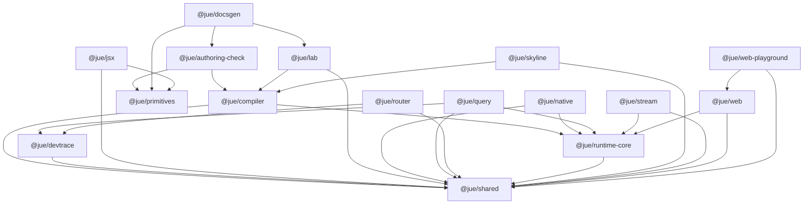

# Monorepo Dependency Report

这个文件由 `@jue/docsgen topology --write` 生成。
它只总结当前 registry 与 workspace manifests 的一致结果，不额外推断未来结构。

## Layer Summary

### Kernel

- `@jue/compiler/ir`
- `@jue/compiler/lowering`
- `@jue/runtime-core`
- `@jue/runtime-core/channel`
- `@jue/runtime-core/host-contract`
- `@jue/runtime-core/reactivity`
- `@jue/shared`

### Official Authoring

- `@jue/authoring-check`
- `@jue/compiler/builder`
- `@jue/compiler/frontend`
- `@jue/jsx`
- `@jue/primitives`

### Official Host

- `@jue/native`
- `@jue/web`

### Official Host Target

- `@jue/skyline`

### Official Stdlib

- `@jue/query`
- `@jue/router`
- `@jue/stream`

### Official Tooling

- `@jue/devtrace`
- `@jue/docsgen`
- `@jue/lab`

### Example Packages

- `@jue/web-playground`
- `jue-current-app`
- `jue-mobile-showcase`

## Package Containers

| Package | Kind | Path | Internal deps |
| --- | --- | --- | --- |
| `@jue/authoring-check` | pure | `packages/authoring/authoring-check` | `@jue/compiler`, `@jue/primitives` |
| `@jue/compiler` | composite | `packages/kernel/compiler` | `@jue/runtime-core`, `@jue/shared` |
| `@jue/devtrace` | pure | `packages/tooling/devtrace` | `@jue/shared` |
| `@jue/docsgen` | pure | `packages/tooling/docsgen` | `@jue/authoring-check`, `@jue/lab`, `@jue/primitives` |
| `@jue/jsx` | pure | `packages/authoring/jsx` | `@jue/primitives`, `@jue/shared` |
| `@jue/lab` | pure | `packages/tooling/lab` | `@jue/compiler`, `@jue/shared` |
| `@jue/native` | pure | `packages/host/native` | `@jue/runtime-core`, `@jue/shared` |
| `@jue/primitives` | pure | `packages/authoring/primitives` | - |
| `@jue/query` | pure | `packages/stdlib/query` | `@jue/devtrace`, `@jue/runtime-core`, `@jue/shared` |
| `@jue/router` | pure | `packages/stdlib/router` | `@jue/devtrace`, `@jue/shared` |
| `@jue/runtime-core` | pure | `packages/kernel/runtime-core` | `@jue/shared` |
| `@jue/shared` | pure | `packages/kernel/shared` | - |
| `@jue/skyline` | pure | `packages/host-target/skyline` | `@jue/compiler`, `@jue/shared` |
| `@jue/stream` | pure | `packages/stdlib/stream` | `@jue/runtime-core`, `@jue/shared` |
| `@jue/web` | pure | `packages/host/web` | `@jue/runtime-core`, `@jue/shared` |
| `@jue/web-playground` | pure | `packages/examples/web-playground` | `@jue/shared`, `@jue/web` |
| `jue-current-app` | pure | `packages/examples/jue-current-app` | - |
| `jue-mobile-showcase` | pure | `packages/examples/jue-mobile-showcase` | - |

## Direct Internal Edges

- `@jue/authoring-check` -> `@jue/compiler` (dependency)
- `@jue/authoring-check` -> `@jue/primitives` (dependency)
- `@jue/compiler` -> `@jue/runtime-core` (dependency)
- `@jue/compiler` -> `@jue/shared` (dependency)
- `@jue/devtrace` -> `@jue/shared` (dependency)
- `@jue/docsgen` -> `@jue/authoring-check` (dependency)
- `@jue/docsgen` -> `@jue/lab` (dependency)
- `@jue/docsgen` -> `@jue/primitives` (dependency)
- `@jue/jsx` -> `@jue/primitives` (dependency)
- `@jue/jsx` -> `@jue/shared` (dependency)
- `@jue/lab` -> `@jue/compiler` (dependency)
- `@jue/lab` -> `@jue/shared` (dependency)
- `@jue/native` -> `@jue/runtime-core` (dependency)
- `@jue/native` -> `@jue/shared` (dependency)
- `@jue/query` -> `@jue/devtrace` (dependency)
- `@jue/query` -> `@jue/runtime-core` (dependency)
- `@jue/query` -> `@jue/shared` (dependency)
- `@jue/router` -> `@jue/devtrace` (dependency)
- `@jue/router` -> `@jue/shared` (dependency)
- `@jue/runtime-core` -> `@jue/shared` (dependency)
- `@jue/skyline` -> `@jue/compiler` (dependency)
- `@jue/skyline` -> `@jue/shared` (dependency)
- `@jue/stream` -> `@jue/runtime-core` (dependency)
- `@jue/stream` -> `@jue/shared` (dependency)
- `@jue/web` -> `@jue/runtime-core` (dependency)
- `@jue/web` -> `@jue/shared` (dependency)
- `@jue/web-playground` -> `@jue/shared` (dependency)
- `@jue/web-playground` -> `@jue/web` (dependency)

## Mermaid

